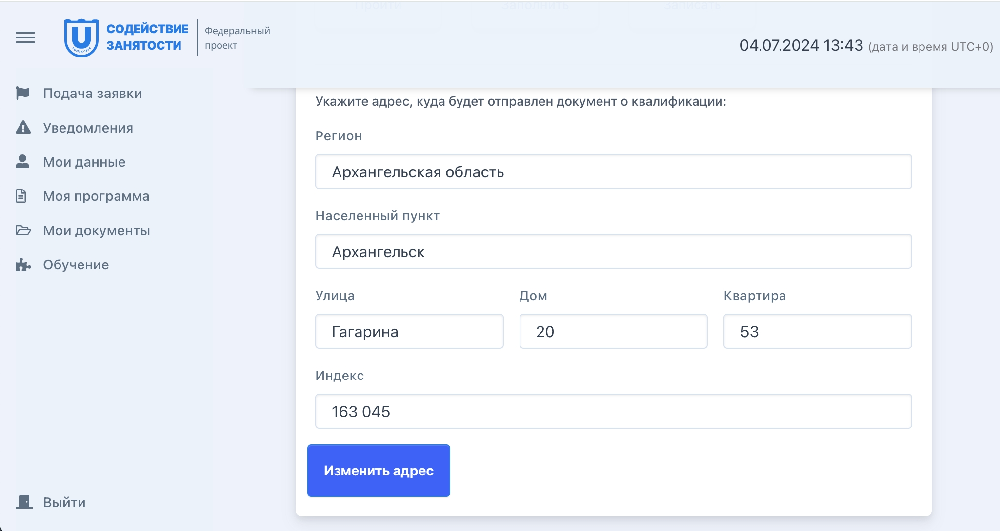
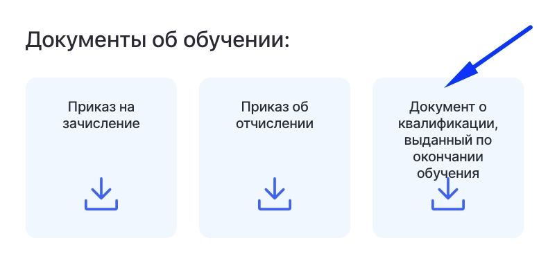

В течение 15 дней после завершения обучения на ваш физический адрес, указанный в разделе "Обучение" будет отправлено письмо с оригиналом  документа, выдаваемого после завершения обучения.

{width=2050px height=1090px}

После отправки в ЛК появится трек-номер письма с документами.

Также в разделе Документы - Документы об обучении будет доступен скан документа о квалификации.

{width=790px height=390px}