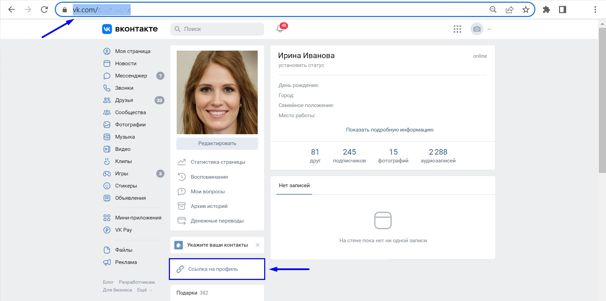
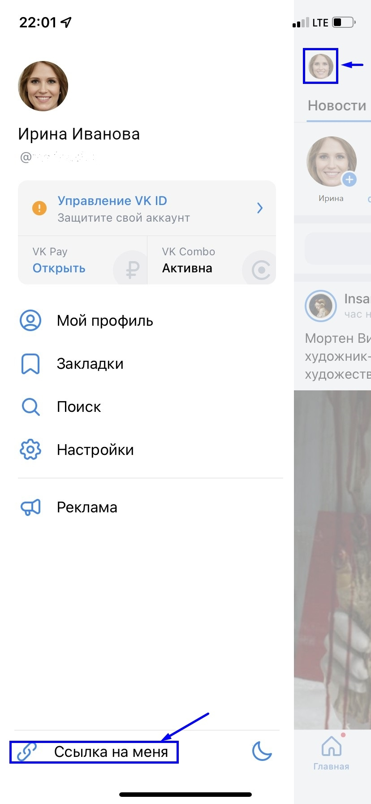

Ваш профиль в ВК может быть использован для анализа эффективности образовательных программ и трудоустройства разных категорий граждан

Для получения ссылки ВКонтакте с **компьютера**:

1. кликните на раздел "Моя страница" (первый пункт в боковом меню).

2. нажмите кнопку "Ссылка на профиль" или скопируйте ссылку из адресной строки браузера. Для этого щелкните правой кнопкой мыши по ссылке и выберите в меню пункт “Копировать”.

Вы получите ссылку, ведущую на вашу страницу. Как правило, она выглядит так: http(s)://vk.com/id\*.

{width=1780px height=886px}

Для получения ссылки ВКонтакте с **телефона**:

1. на Главной странице нажмите на ваш аватар в левом верхнем углу.

2. нажмите кнопку "Ссылка на меня". (Вставить с телефона после копирования возможно, зажав пальцем на поле для ввода текста, в появившемся меню необходимо выбрать пункт "Вставить").

   {width=828px height=1792px}

