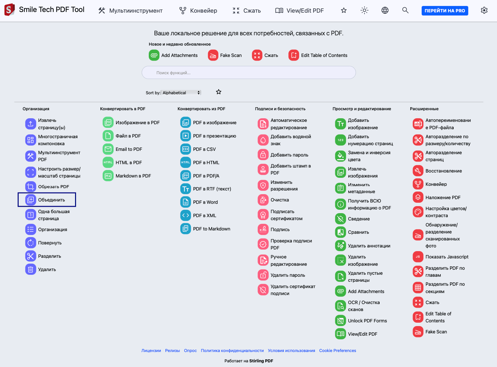
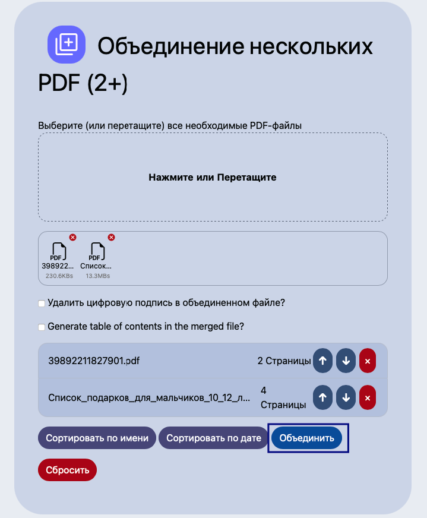

Для объединения нескольких файлов в формате PDF мы рекомендуем использовать сервис <https://pdf-tool.smile-tech.study/?lang=ru_RU>.

Для этого откройте ссылку, выберите «Объединить».

{width=1490px height=1102px}

Откроется окно, в которое надо загрузить несколько файлов в формате PDF для дальнейшего объединения. После загрузки нажмите на «Объединить».

{width=719px height=872px}

Объединенный файл загрузится на ваш компьютер. 

Готово.