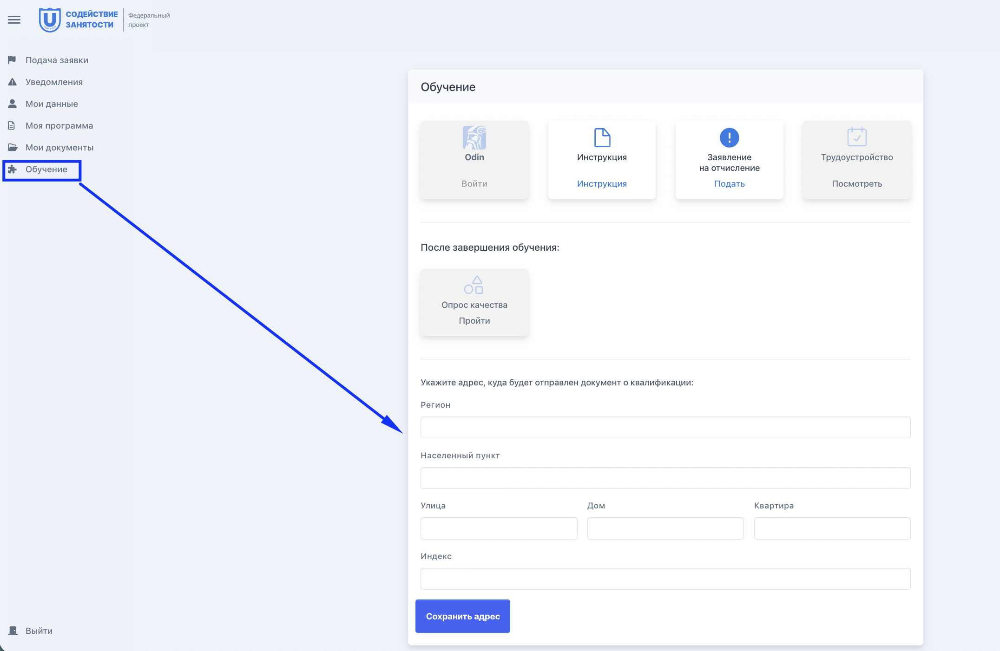

Если во время обучения вы переехалили или сменился адрес, куда образовательной организации следует отправить документ о квалификации, заполните новый адрес в блоке «Обучение».

{width=2152px height=1402px}

:::note 

Если поля для заполнения недоступны, срочно свяжитесь с куратором и сообщите, что не сможете принять документ по указанному адресу. 

Недоступными поля становятся тогда, образовательная организация уже отправила документ или подготовила его к отправке.

:::