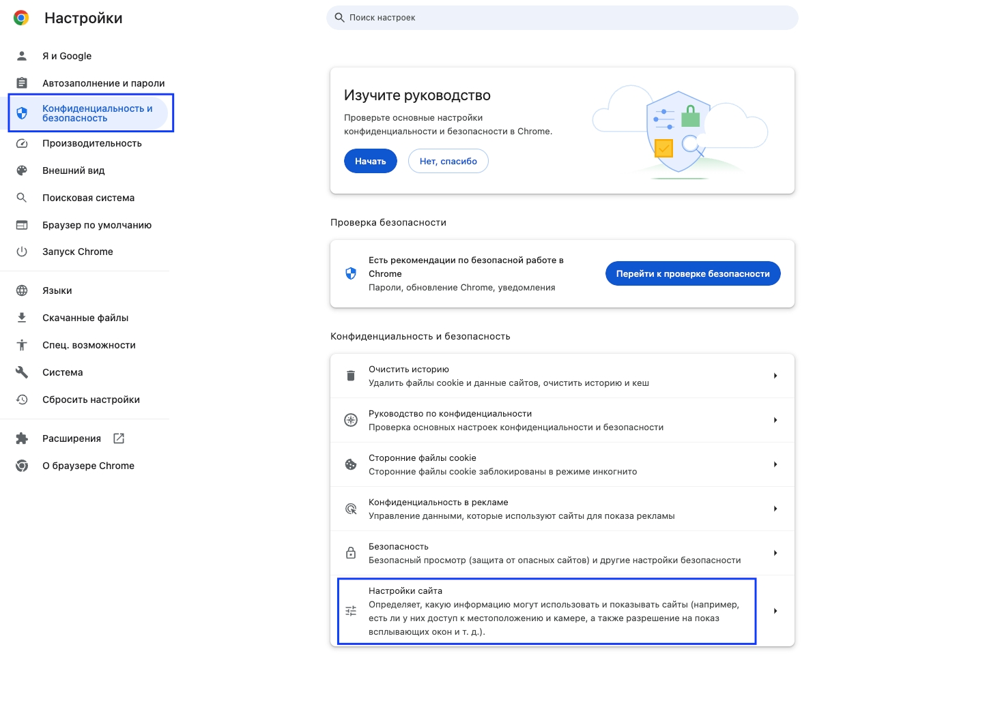
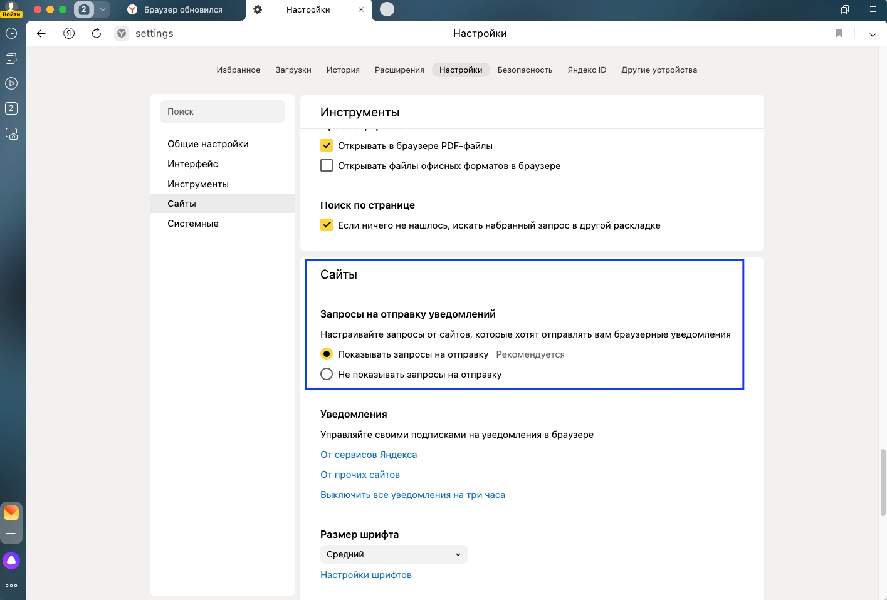
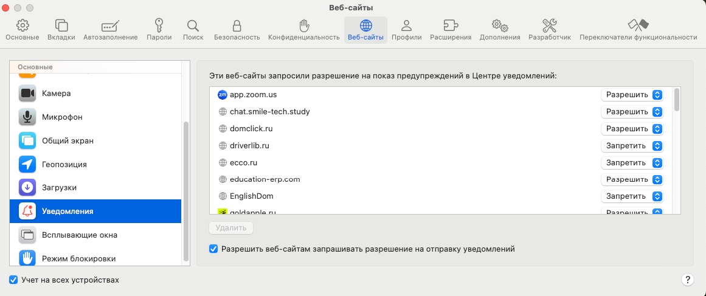
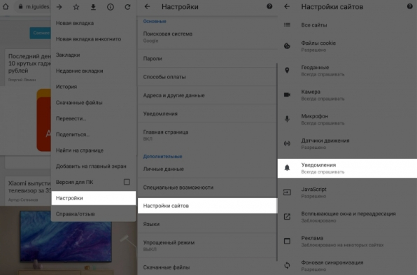
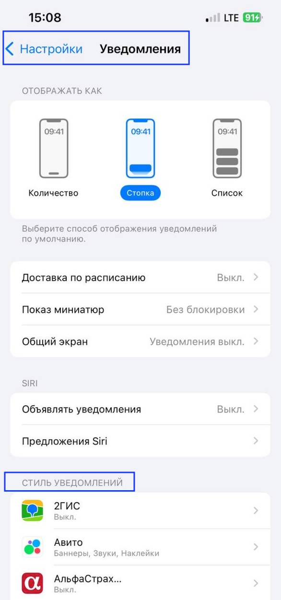

Основные браузеры и включение уведомлений в них

**Windows/Mac OS**

[tabs]

[tab:Google Chrome]

1. Откройте браузер Chrome на компьютере.

2. В правом верхнем углу окна нажмите на значок с тремя точками, выберите Настройки.

3. Нажмите Конфиденциальность и безопасность - в самом низу строка Настройки сайтов - Уведомления (в блоке Разрешения).

4. Выберите параметры, которые будут действовать по умолчанию, а также добавьте сайты, с которых будут приходить уведомления на устройство.

   {width=1465px height=1034px}

[/tab]

[tab:Яндекс.Браузер]

1. Откройте Яндекс.Браузер на компьютере

2. В разделе Уведомления нажмите Уведомления --> Уведомления от сайтов.

3. В списке Разрешены или Заблокированы нажмите название нужного сайта.

4. Включите опцию Блокировать или Разрешить.

   {width=1415px height=958px}

[/tab]

[tab:Safari]

1. Откройте Safari на компьютере

2. В левом верхнем углу выберите Safari - Настройки - Веб-сайты.

3. В левой колонке выберите "Уведомления".

4. Разрешите или запретите уведомления для сайтов.

{width=1161px height=487px}

[/tab]

[/tabs]

#### **iPhone/Android**

[tabs]

[tab:Google Chrome]

1. Откройте браузер Chrome на устройстве Android.

2. Справа от адресной строки нажмите на значок с тремя точками Настройки.

3. Выберите Настройки сайтов Уведомления.

4. Установите переключатель вверху экрана в нужное положение.

   {width=596px height=393px}

   **! На устройствах iPhone и iPad уведомления в Chrome не поддерживаются.**

[/tab]

[tab:Браузеры iPhone]

1. Откройте Настройки на iPhone.

2. Выберите Уведомления.

3. В блоке Стиль уведомлений настройте уведомления для браузера.

   {width=586px height=1251px}

[/tab]

[/tabs]