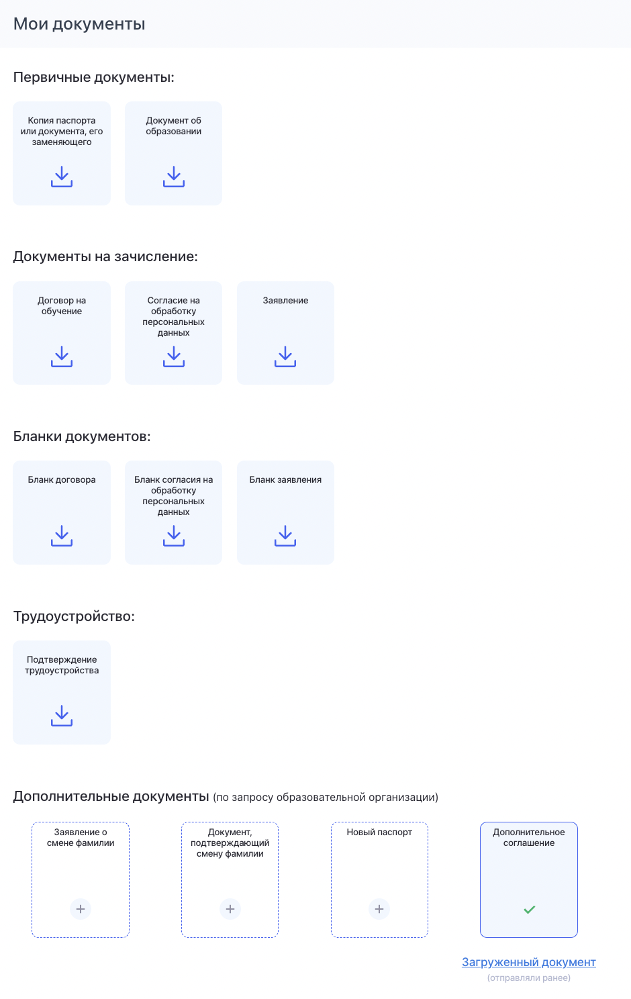

У граждан есть  возможность загружать через ЛК Гражданина документы, подтверждающие смену ФИО, даже после начала обучения.\
Сделать это можно в разделе «Мои документы» в подразделе «Дополнительные документы (по запросу образовательной организации)».

{width=783px height=1087px}

Данный подраздел будет доступен только после того, как одобрены ДЗС.

