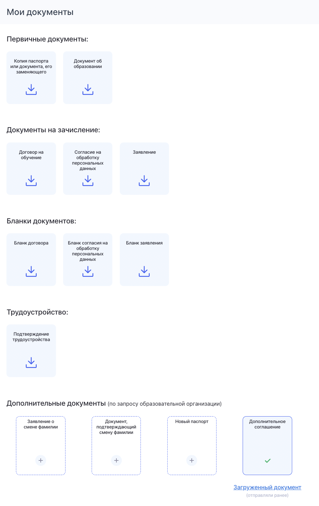

:::note 

Загружать документы потребуется  **не всем**.  

Если у вас изменились личные  данные во время обучения, свяжитесь с куратором или ответственным за программу, если потребуется, то вас попросят загрузить документы через Личный кабинет.

:::

\
Сделать это можно в разделе «Мои документы» в подразделе «Дополнительные документы (по запросу образовательной организации)», в случае, если документы на зачисление одобрены.

{width=940px height=1488px}